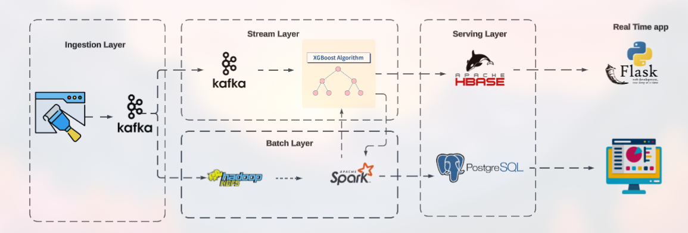
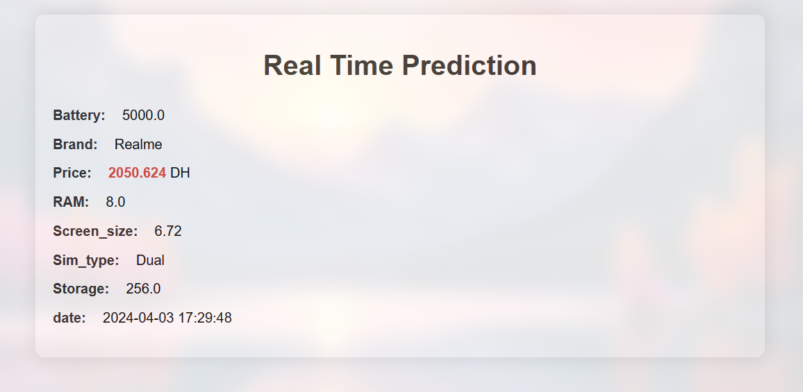
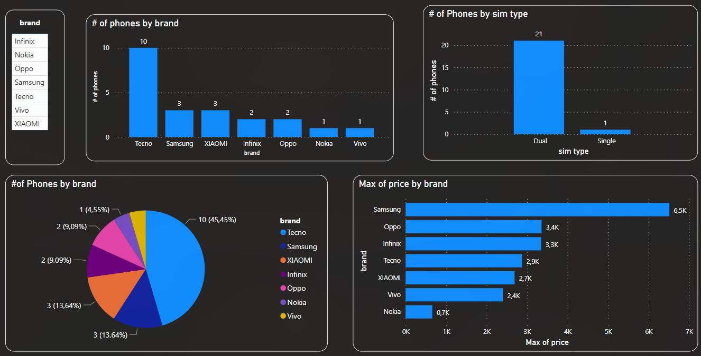

# Predict-Phone-Price Using Lambda Architecture

## 1. Tổng Quan Dự Án

Dự án này nhằm mục đích **dự đoán giá điện thoại thông minh** bằng cách kết hợp giữa xử lý theo lô (batch) và xử lý luồng (stream) trong môi trường Big Data. Kiến trúc hệ thống tuân theo mô hình **Lambda Architecture**, cho phép xử lý dữ liệu theo thời gian thực và theo lô. Dữ liệu được sử dụng trong project này được crawl bằng thư viện **Selenium** từ 2 trang web điện thoại là [ClickBuy](https://clickbuy.com.vn/) và [Điện Thoại Giá Kho](https://dienthoaigiakho.vn/?srsltid=AfmBOootMLeO8-RmRtNHyrKBLlelxT3GptXehKNQpkNHSjRBtNDkcNyP).

---

## 2. Công Nghệ Sử Dụng

- **Lớp Thu Thập (Ingestion Layer):** Apache Kafka (message broker)
- **Lớp Xử Lý Luồng (Stream Layer):** XGBoost (mô hình học máy), Apache HBase (real-time view)
- **Lớp Xử Lý Theo Lô (Batch Layer):** Apache Spark, PostgreSQL
- **Lớp Hiển Thị (Visualization):** Spring Boot (web), Power BI (dashboard)

---
## 3. Kiến Trúc Hệ Thống

Hệ thống gồm 5 lớp chính: thu thập dữ liệu, xử lý luồng, xử lý theo lô, lớp phục vụ và lớp hiển thị.

### Ingestion Layer

- **Apache Kafka**: Thu thập dữ liệu thời gian thực từ API.
- **Consumer**: Nhận dữ liệu và đẩy vào stream và batch layer.

### Stream Layer

- **XGBoost**: Dự đoán giá điện thoại theo thời gian thực. Kết quả lưu vào HBase.  

### Batch Layer

- **HDFS**: Lưu trữ dữ liệu từ API dưới dạng data lake.
- **PySpark**: Biến đổi dữ liệu đã lưu.

### Serving Layer

- **Real-time View (HBase)**: Lưu trữ dự đoán theo thời gian thực.
- **Batch View (PostgreSQL)**: Lưu trữ dữ liệu đã xử lý.

### Visualization Layer

- **Flask Web App**: Tạo một giao diện dơn giản nhất để xem dữ liệu thời gian thực.
- **Power BI**: Dashboard phân tích dữ liệu lịch sử.

---

## 4. Dashboards

Dự án này sử dụng hai bảng điều khiển để trực quan hóa dự đoán giá điện thoại thông minh và dữ liệu lịch sử:

#### **1. Flask web**

- Bảng điều khiển này được xây dựng bằng ứng dụng web Flask.
- Nó hiển thị **giá điện thoại thông minh dự đoán theo thời gian thực**.
- Người dùng có thể truy cập bảng điều khiển này thông qua giao diện web.

Giao diện của ứng dụng web Flask như sau:

#### **2. Bảng điều khiển theo lô (Power BI):**

- Bảng điều khiển này sử dụng Power BI để khám phá dữ liệu tương tác.
- Nó cung cấp cái nhìn sâu sắc về **xu hướng giá điện thoại thông minh trong quá khứ**.
- Bảng điều khiển này được thiết kế dành cho người dùng phân tích theo lô quan tâm đến dữ liệu lịch sử.

Dưới đây là bảng điều khiển được tạo bằng Power BI:

